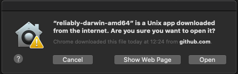
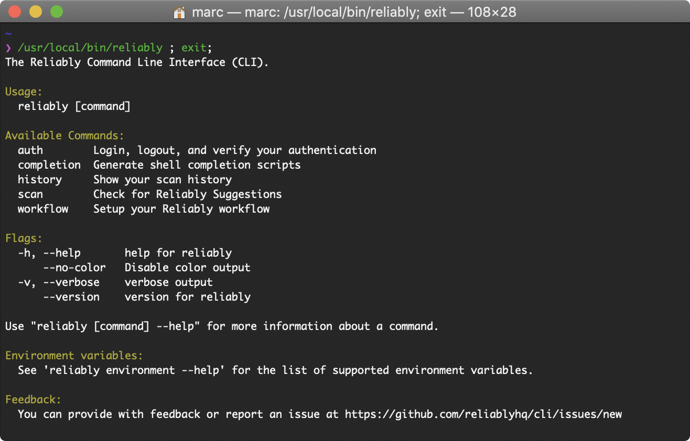
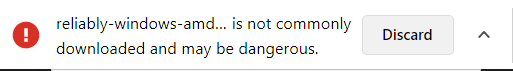

import CopyToClipboard from '~/components/MarkdownCopyToClipboard.vue'

# Installing the Reliably CLI

## Quick Install Guide

Download the latest executable for your system, and copy it to a directory in
your PATH.

On macOS

```console
curl -L https://github.com/reliablyhq/cli/releases/latest/download/reliably-darwin-amd64 -o /usr/local/bin/reliably
```
<CopyToClipboard />

On Linux

```console
curl -L https://github.com/reliablyhq/cli/releases/latest/download/reliably-linux-amd64 -o /usr/local/bin/reliably
```
<CopyToClipboard />

Make it executable.

```console
chmod +x /usr/local/bin/reliably
```
<CopyToClipboard />

On Windows

```console
curl -L https://github.com/reliablyhq/cli/releases/latest/download/reliably-windows-amd64 -o %HOMEDRIVE%%HOMEPATH%/bin/reliably.exe
```

<CopyToClipboard />

You're good to go!

You can check everything is working with the `reliably --version` and you're
ready to [login](../login/).

:::tip Tip
  If you are a Kubernetes user you can also install Reliably as a [kubectl
   plugin][kubectl-plugin], and run Reliably commands with `kubectl`.
:::

[kubectl-plugin]: ../kubectl-plugin/

See the  [Installation Details][install-detail] section for more detailed
 instructions, including guidance for Windows users.

[install-detail]: #installation-details

## Previous versions

You can find the full list of Reliably CLI releases [here][releases].

[releases]: https://github.com/reliablyhq/cli/releases/

## Installation Details

### MacOS

Get the latest release and copy it to a directory in your PATH, for example
/usr/local/bin.

```console
curl -L https://github.com/reliablyhq/cli/releases/latest/download/reliably-darwin-amd64 -o /usr/local/bin/reliably
```
<CopyToClipboard />

You can also [download the latest macOS Release](https://github.com/reliablyhq/cli/releases/latest/download/reliably-darwin-amd64/)
from your browser. To make Reliably convenient to run move the
executable to a directory that is on your path, for example ```/usr/local/bin```.

If you downloaded the file from your browser (ie, not with `curl`), you might
want to rename it:

```console
mv reliably-darwin-amd64 reliably
```
<CopyToClipboard />

Make the file executable. If needed, change the path to reliably to match the
location you chose.

```console
chmod +x /usr/local/bin/reliably
```
<CopyToClipboard />

Then in a terminal window execute:

```console
reliably --version
```
<CopyToClipboard />

You should see the current ```reliably``` cli version displayed.

:::tip
When you first run the `reliably` command, macOS might display a prompt. It
might look different from this one, if you're running macOS Big Sur or newer.



Select ```Open``` and a terminal window will pop-up showing:



The app will be saved as an exception to your security settings and now you
will be able to run it from the command line.
:::

### Linux (Ubuntu)

Get the latest release and copy it to a directory in your PATH, for example
/usr/local/bin.

```console
curl -L https://github.com/reliablyhq/cli/releases/latest/download/reliably-linux-amd64 -o /usr/local/bin/reliably
```
<CopyToClipboard />

You can also [download the latest Linux release](https://github.com/reliablyhq/cli/releases/latest/download/reliably-linux-amd64)
from your browser. To make Reliably convenient to run move the
executable to a directory that is on your path, for example ```/usr/local/bin```.

If you downloaded the file from your browser (ie, not with `curl`), you might
want to rename it:

```console
mv reliably-darwin-amd64 reliably
```
<CopyToClipboard />

If you want to check the file has not been corrupted, navigate to the directory
where you downloaded the Reliably and check the md5 checksum.

```console
md5sum reliably-linux-amd64
cab791d7d4b4e5a0dcf00392b4ce672c  reliably-linux-amd64
```

Compare the md5 checksum displayed with the [MD5 checksum file](https://github.com/reliablyhq/cli/releases/latest/download/reliably-linux-amd64.md5), they should match.

Make the file executable. If needed, change the path to reliably to match the
location you chose.

```console
chmod +x /usr/local/bin/reliably
```
<CopyToClipboard />

Then in a terminal window execute:

```console
reliably --version
```
<CopyToClipboard />

You should see the current ```reliably``` cli version displayed.

### Windows 10


#### Install with curl

The quick and easy way to install the Reliably CLI on Windows is to use `curl`:

```console
curl -L https://github.com/reliablyhq/cli/releases/latest/download/reliably-windows-amd64 -o %HOMEDRIVE%%HOMEPATH%/bin/reliably.exe
```

<CopyToClipboard />


:::note Note
The above command assumes you have the `curl` command available and you have a `bin` folder in your home directory. For ease of use, ensure the `bin` folder is on your path.

You can install the Reliably CLI in any directory you like. Just update the `curl` command above as required.

`curl` is available as a Windows 10 command after version 1706. On other versions of Windows, you can [download curl] from the official curl website.
:::

[download curl]:https://curl.se/download.html

#### Manual Install

Download the latest [Windows 10 Release](https://github.com/reliablyhq/cli/releases/latest/download/reliably-windows-amd64) to a working directory.

When you select the download button you may see a browser warning:



Select the menu option and keep. You can then navigate to the file location
using your prefered terminal window (in these docs we are using Powershell).

If you want, you can check the md5 checksum to confirm the downloaded file has
not been corrupted:

```powershell
PS D:\progams\reliably Get-FileHash .\reliably.exe -algorithm md5

Algorithm           Hash
---------           ----
MD5                 1234556789
```

Compare the md5 checksum displayed with the md5 checksum in the
[MD5 checksum file](https://github.com/reliablyhq/cli/releases/latest/download/reliably-windows-amd64.md5),
they should match.

To execute ```reliably CLI``` you will need to rename the file and add a
```.exe``` file extension. In the terminal window type:

```console
move .\reliably-windows-amd64 .\reliably.exe
```
<CopyToClipboard />

Then execute:

```console
.\reliably.exe --version
```
<CopyToClipboard />

You should see the current Reliably CLI version displayed.

At this point, to make Reliably convenient to run, add the folder to the
executable path. Open the Windows Start Search, type in “env”, and choose “Edit the system environment variables”.
In the pop-up window select:

* Environment Variables
* In the Enviroment Variables pop-up, select Path from the User environment variables
* Select Edit then
* Select Browse...
* Navigate to the folder where you downloaded the reliably executable
* Select OK

Open a new Powershell window and type ```reliably --version```, the version of
the Reliably CLI should be displayed.

Reliably CLI will now be available in you Powershell sessions.
