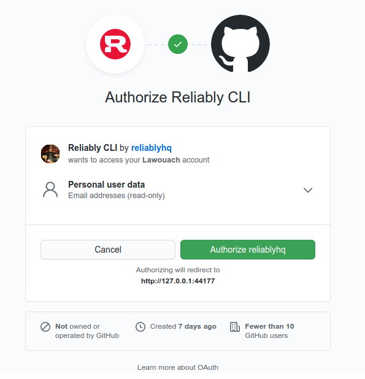

# Login to Reliably

To use Reliably, you will need to authenticate the Reliably CLI
with [Reliably.com](https://reliably.com/).

:::tip Tip
  You can authenticate with third party OAuth providers. Reliably
  currently supports GitHub and GitLab.

  Reliably requires only access to the minimal set of information to create
  your profile. Usually your username and email address.
:::

## Login

You can login with the `reliably auth login` command, when prompted for the
type of login select a provider, with the arrow keys and select enter:

```reliably
<span class="token dollar"></span>reliably auth login
Logging into reliably.com
<span class="token green">?</span> <span class="token bold">How would you like to authenticate?</span>  <span class="token blue">[Use arrows to move, type to filter]</span>
<span class="token blue bold">&gt; Login with GitHub</span>
  Login with GitLab
  Paste an authentication token
```

An authentication page will be launched in your browser, for instance with
the GitHub provider:



When you accept the challenge, the browser will show a message to close its
window and the CLI will acknowledge you are now logged in.

```reliably
<span class="token green">✓</span> Logged in as user
```

You have successfully logged in to Reliably and are now ready to use the
`reliably` commands.

## Authentication status

You can check your authentication status with the `reliably auth status` command:

```reliably
<span class="token dollar"></span>reliably auth status
reliably.com
  <span class="token green">✓</span> Logged in to reliably.com as user (~/.config/reliably/config.yaml)
  <span class="token green">✓</span> Token: *******************
```

## Access token

You can retrieve your access token (aka API key) with the `reliably auth status --show-token` command:

```reliably
<span class="token dollar"></span>reliably auth status --show-token
reliably.com
  <span class="token green">✓</span> Logged in to reliably.com as user (~/.config/reliably/config.yaml)
  <span class="token green">✓</span> Token: 6ccfdxxxxxxxxxxxxxxxxxxxxxxxxxxxxxxxxxxx
```

## Logout

You can logout with the `reliably auth logout` command:

```reliably
<span class="token dollar"></span>reliably auth logout
<span class="token green">?</span> <span class="token bold">Are you sure you want to log out of reliably.dev account 'user'?</span> <span class="token blue">Yes</span>
Logged out of reliably.com account 'user'
```

Your client session is now logged out from Reliably and you can no further
pass commands to Reliably.

## Authenticate for CI/CD

When running the CLI in a CI/CD environment or simply where interactive login
is not wanted, the CLI can be authenticated by using the `RELIABLY_TOKEN`
environment variable.
Using the environment variable overriddes the token stored into the config.

```
$ export RELIABLY_TOKEN=6ccfdxxxxxxxxxxxxxxxxxxxxxxxxxxxxxxxxxxx
```

Once the environment variable is defined, any command of the CLI will
be able to make authenticated calls to Reliably.