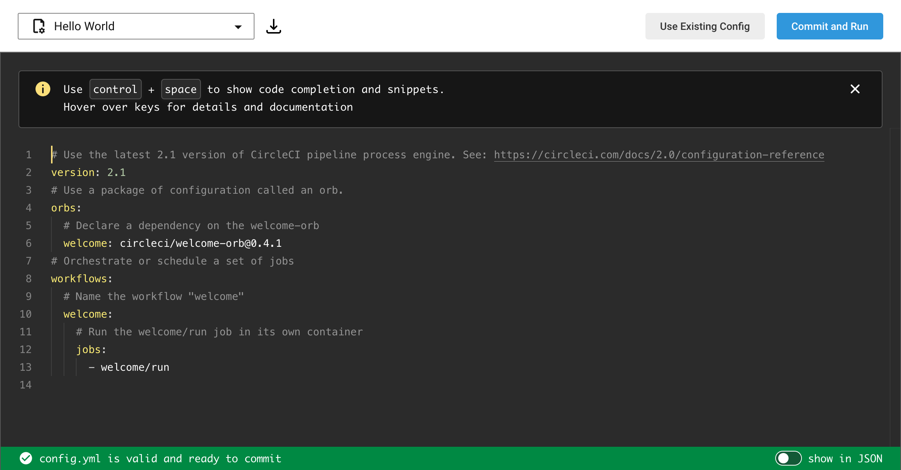
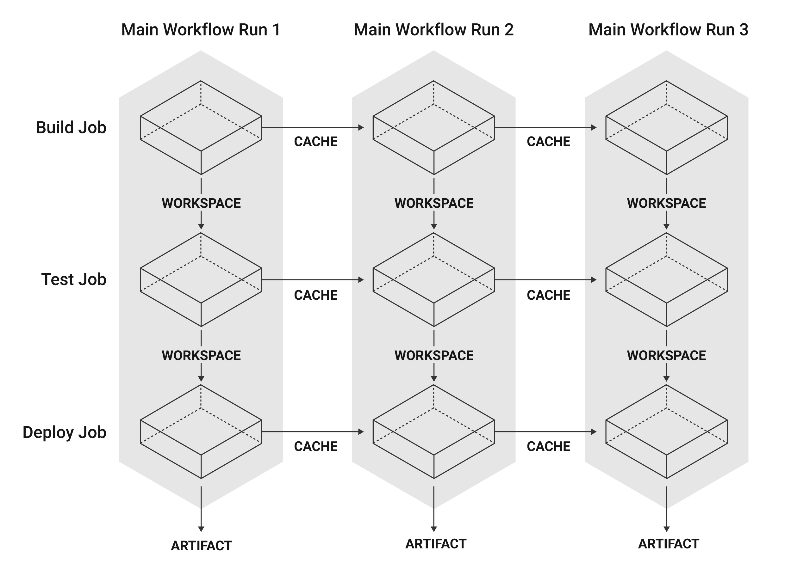
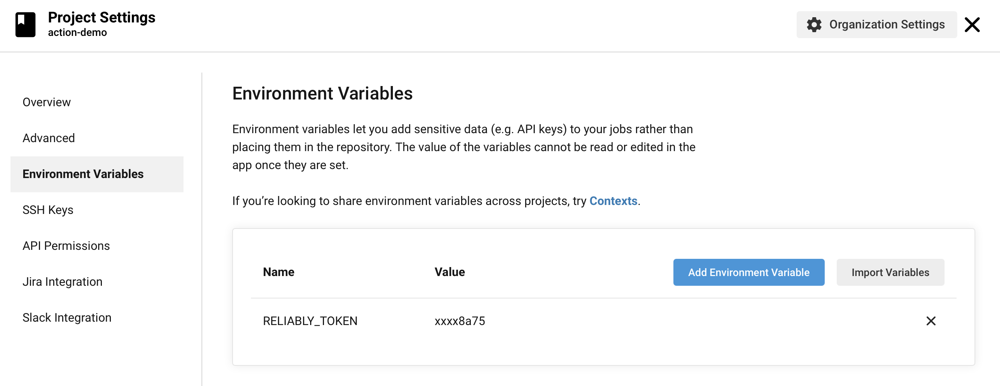
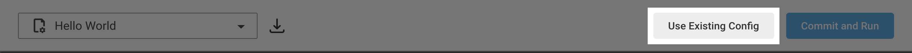
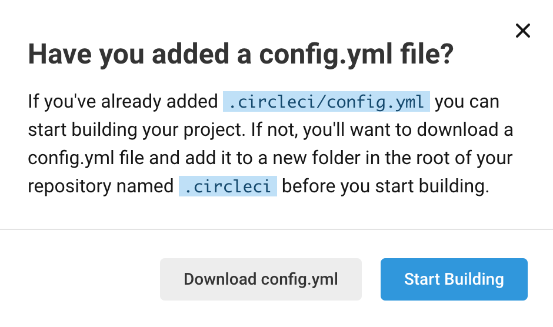
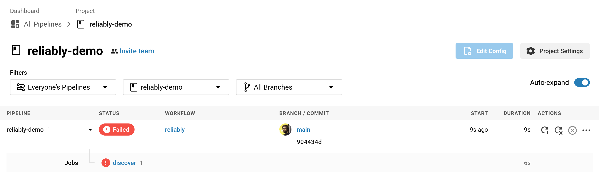
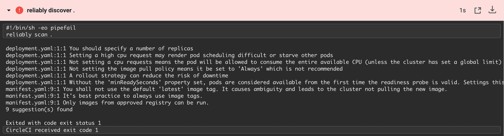

import CopyToClipboard from '~/components/MarkdownCopyToClipboard.vue'

# Add Reliably to your CircleCI Build

:::note
This guide uses the CircleCI Cloud version.
:::

This guide will show you how you can add Reliably to your
[CircleCI](https://circleci.com) build as a CircleCI job.

:::note Note
  You can automatically generate the workflow file using our CLI:
  ```console
  reliably workflow --platform circleci
  ```
  <CopyToClipboard />

:::

## Set up a project in CircleCI

Once your logged into CircleCI, set up a new project or select a project
already building on CircleCI.

Making a project run on CircleCI requires a configuration file located at
`.circleci/config.yml`. If you're adding a new project, CircleCI will provide
with a configuration template, according to the language it detected in your
repository. You can select another template from the list if you want to.

Here is their "Hello World" template.


You can edit this `config.yml` file and commit it to your repository directly
from CircleCI, or download it.

You can also choose to use an existing configuration file and commit it to your
repository.

If you chose a project that already builds on CircleCI, it already has a
`.circleci/config.yml` file.

## CircleCI jobs and workflows

Circle CI uses workflows as sets of rules for defining a collection of jobs and
their run order. Jobs are collections of steps, executed in a single unit.

The following image from the CircleCI documentation illustrates a set of
workflows with jobs.



While you don't need to know more about jobs and workflow to add Reliably to your
CircleCI build, you will find [more detailed information in the CircleCI documentation](https://circleci.com/docs/2.0/jobs-steps/).

## Setup your Reliably access token as environment variable

The CLI must be run with a valid access token to make authenticated calls
to Reliably.

As a pre-requesite, the `RELIABLY_TOKEN` must be defined as a secret
environment variable in your project's settings;
See how to [set an environment variable in a project]
(https://circleci.com/docs/2.0/env-vars/#setting-an-environment-variable-in-a-project).



You can see how to [retrieve your access token](/docs/getting-started/login/#retrieve-your-access-token/).

## Create the Reliably job

We will now define Reliably as a job, before adding it to a
new or existing workflow.

This is how CircleCI defines a job, in YAML:
```yml
<job name>
  <executor>
  <steps>
```

We will name our job `scan`, as we want to run the `reliably scan`
command.

The executor will be a Docker image of Reliably, which we want to run in the
`/home` directory.

Our job will be made of two steps:
* The first step will checkout the code in the repository
* The second step will run the `reliably scan kubernetes .` command to find Kubernetes
manifests and surface potential reliability issues

Here is our completed job:

```yml
scan:
  docker:
    - image: ghcr.io/reliablyhq/cli/cli:latest
      environment:
        RELIABLY_TOKEN: $RELIABLY_TOKEN
  working_directory: /home
  steps:
    - checkout # check out the code in the project directory
    - run: reliably scan kubernetes .
```

## Add the job to a workflow

This is how CircleCI defines a workflow, in YAML:

```yaml
<workflow name>
  jobs
    <optional triggers>
    <job name>
```

We will create a `reliably` workflow, with a single job, `scan`.
```yml
reliably:
  jobs:
    - scan
```

## Final config.yml file

The most simple file CircleCI configuration file will then look like this:

```yaml
version: 2.1
jobs:
  scan:
    docker:
      - image: ghcr.io/reliablyhq/cli/cli:latest
        environment:
          RELIABLY_TOKEN: $RELIABLY_TOKEN
    working_directory: /home
    steps:
      - checkout # check out the code in the project directory
      - run: reliably scan kubernetes .

workflows:
  reliably:
    jobs:
      - scan
```

Commit this file to your repository and go back to your project in CircleCI
Cloud, where you can now click the **Use Existing Config** button.



In the modal window that opens next, click **Start Building**.

<div style="max-width: 470px">



</div>

CircleCI will then redirect you to your builds page where you can see the
results of your workflow.



Here you can see that the pipeline failed because of the `reliably scan kubernetes .`
step. Reliably surfaced possible reliability issues and returned an error that
caused the pipeline to fail. The Reliably CLI outputs the list of issues in the
pipeline steps output.



**Your workflow will now run each time you push to your repository.**

You can also schecule workflow by adding a `triggers` key and specify a
`schedule`. This would allow you, for example, to run Reliably on a daily basis.
Read the CircleCI documentation about [scheduling workflows](https://circleci.com/docs/2.0/workflows/#scheduling-a-workflow)
for more details.

Congratulations, you now integrated Reliably into your CircleCI build!
