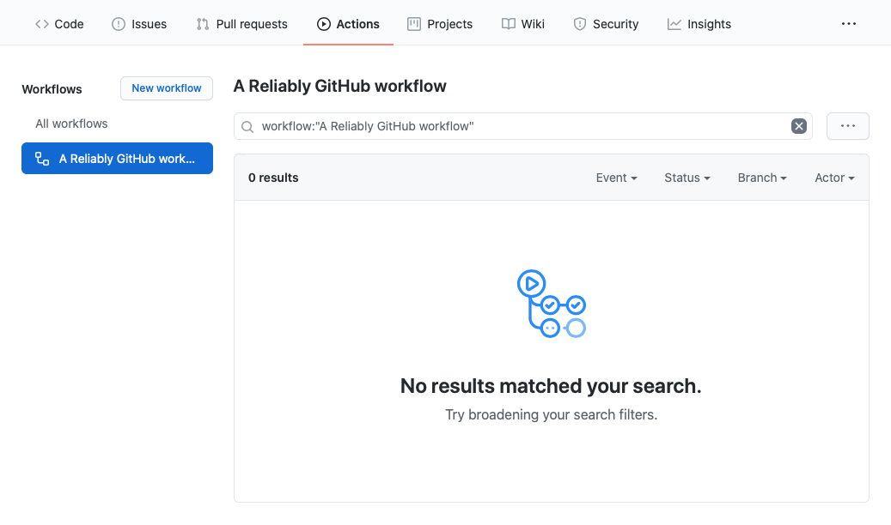

# Add Reliably to your GitHub Workflow

Adding Reliably to your GitHub repositories is as simple as adding a GitHub Workflow with a GitHub Action.

:::note Note
  The sources used in <code>this</code> walkthrough are available in this [demo repository](https://github.com/reliablyhq/action-demo/).
:::

:::note Note
  You can automatically generate the workflow file using our CLI:
  ```
  $ reliably workflow --platform github
  ```
:::

## Setup your Reliably access token as Secret

As a pre-requisite, we advice to set up your Reliably access token as a GitHub secret,
to avoid exposing secure information within your workflow file.

You can see how to [retrieve your access token](/docs/getting-started/login/#retrieve-your-access-token/).

To add a secret to your GitHub repository, go to Settings > Secrets > New repository secret
or follow the [documentation](https://docs.github.com/en/actions/reference/encrypted-secrets):


We'll name our secret `RELIABLY_HOST`, as used in the workflow example.
You can choose another one of your liking but remember to change it in the workflow accordingly.

## Add a new workflow to your repository

For this walkthrough we're going to add a fresh workflow to a repository, however
the same steps could be taken to add the Reliably action to a workflow you might
already have.

In the repository that you want Reliably to work with, add a new workflow in `
.github/workflows` called `reliably.yaml` with the following content:

```yaml
name: A Reliably GitHub workflow

on:
  push:

env:
  RELIABLY_TOKEN: ${{ secrets.RELIABLY_TOKEN }}

jobs:
  reliably:
    runs-on: ubuntu-latest
    steps:
      - name: 'Checkout source code'
        uses: actions/checkout@v2
      - name: 'Run Reliably'
        uses: reliablyhq/gh-action@v1
```

This workflow describes that GitHub should:

1. Listen for any pushes
3. Run a new job using the `ubuntu-latest` image.
4. Checkout the source code using GitHub's own `actions/checkout@v2` action.
5. Run Reliably's GitHub Action.

You should now have the following in your repository (along with any other files you already had!):

```
.github
└── workflows
    └── reliably.yaml
```

Make sure that you new workflow has been committed and pushed to GitHub. One you've pushed the changes, navigate
to the `Actions` tab on your repository on GitHub and you should see that your new workflow has been added:




## Enable Code Scanning Alerts
<a href="https://docs.github.com/en/free-pro-team@latest/github/finding-security-vulnerabilities-and-errors-in-your-code/automatically-scanning-your-code-for-vulnerabilities-and-errors/" target="_blank" rel="noopener noreferer">Code Scanning</a> is a GitHub feature which groups potential vulnerabilities in the Security tab of your repository. To enable Code Scanning Alerts, you need to:

* tell the action to continue on error
* output the errors to a SARIF report file
* upload this SARIF report to GitHub Code Scanning

An example YAML workflow file that applies this would include:

```yaml
name: Reliably GitHub workflow with SARIF report

on:
  push:

env:
  RELIABLY_TOKEN: ${{ secrets.RELIABLY_TOKEN }}

jobs:
  reliably:
    runs-on: ubuntu-latest
    steps:
      - name: 'Checkout source code'
        uses: actions/checkout@v2
      - name: 'Run Reliably'
        uses: reliablyhq/gh-action@main
        continue-on-error: true
        with:
          format: "sarif"
          output: "reliably.sarif"
      - name: Upload result to GitHub Code Scanning
        uses: github/codeql-action/upload-sarif@v1
        with:
          sarif_file: reliably.sarif
```

## Trigger your new Reliably workflow

Now you can trigger this workflow by committing and pushing a `manifest.yaml` file into the root of your repository.
Do that now with a `manifest.yaml` file that contains the following:

```yaml
---
apiVersion: v1
kind: Namespace
metadata:
  name: reliably

---
apiVersion: v1
kind: Pod
metadata:
  name: chaostoolkit
  labels:
    app: chaostoolkit
spec:
  restartPolicy: Never
  containers:
  - name: chaostoolkit
    image: chaostoolkit:latest
```

This `manifest.yaml` file has been specifically written to trigger some of
Reliably's Suggestions. You should now have the following in your repository:

```
manifest.yaml
.github
└── workflows
    └── reliably.yaml
```

Again, make sure you've commited and pushed your changes to GitHub on the `main` branch. When you have pushed your changes,
head on over again to the `Actions` tab on your repository in GitHub and you should see that an action has been triggered, or
even completed:


Click on the result for the one execution of the workflow and you will see that it is the `Reliably` action that has
failed the workflow:


Now click on the `x reliably` entry and you will see the Suggestions that Reliably has delivered based upon the contents of
your repository:


Reliably has surfaced three Suggestions:

1. The "Reliably" namespace is forbidden.
2. The usage of `Latest` for tags is forbidden.
3. The indicated image, `chaostoolkit:latest` comes from an untrusted registry.

All of these Reliably Suggestions *could* lead to reliability problems if you were to apply this manifest to your system.

If you enabled Code Scanning Alerts and Reliably surfaces some Reliably
Suggestions, then the Security tab in your repository will now display the
number of suggestions.


Clicking on the `Security` tab will display the Security page for your repository. The lefthand menu will allow you to display the Code scanning alerts.


All your Code Scanning alerts will be listed there. Here, we have two alerts prompted by Reliably Suggestions.


Each alert is displayed in the context in which it was triggered. In this example, the `manifest.yaml` file. The Reliably Suggestion is also displayed.


:::note Note
  Currently the highlighted line is the beginning of the resource, but it's intended to soon be the precise line of the suggestion in the source code.
:::

## Next?

Congratulations, you now have Reliably plugged into a repository on GitHub so that Reliably can start surfacing Reliability Suggestions as you evolve your code. Next take a look at the various features and toggles available on your Reliably GitHub action to take full control of how Reliably surfaces Reliability Suggestions.


