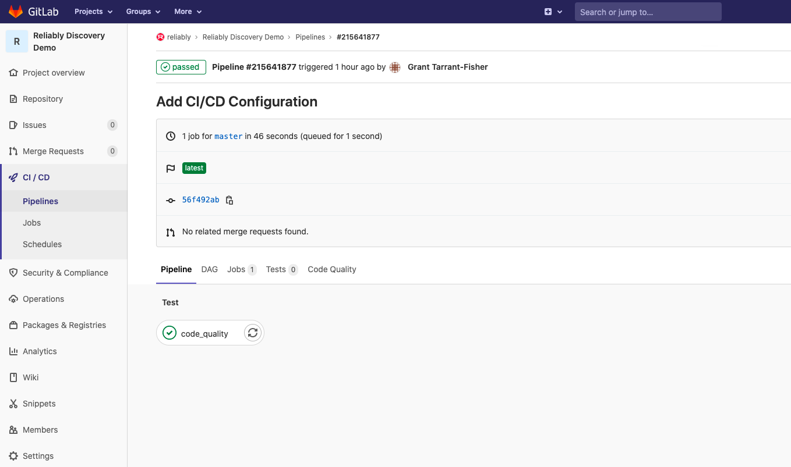

# Add Reliably to your GitLab CI/CD Pipeline

Adding Reliably to your GitHub repositories is as simple as adding GitLab CI/CD
to your repository.

!!! note
    The sources used in this walkthrough are available in this
    [demo repository][demo-repo].

[demo-repo]: https://gitlab.com/reliably/reliably-discovery-demo

## Add GitLab CI/CD to your repository

For this walkthrough, we're going to add a CI/CD Pipeline to a new GitLab
repository. If you have an existing GitLab repository with CI/CD setup you
can jump ahead to
where we [Add Reliably to GitLab CI/CD](#add-reliably-to-gitlab)

Reliably integrates with GitLab through [GitLab CI/CD][gl-cicd]. CI/CD is
configured by creating a file called `.gitlab-ci.yml`
at the root of your GitLab repository.

You can read more about the [GitLab Pipeline Architecture][gl_pipeline_arch]
in the GitLab Reference documentation. The first section describes a
[basic pipeline][gl_basic_pl], with a useful diagram to visualise the concept.
A basic GitLab CI/CD Pipeline will run everything on one stage in parallel,
then it will do the same for the subsequent stage.

[gl-cicd]: https://docs.gitlab.com/ee/ci/README.html
[gl_pipeline_arch]:https://docs.gitlab.com/ee/ci/pipelines/pipeline_architectures.html
[gl_basic_pl]:https://docs.gitlab.com/ee/ci/pipelines/pipeline_architectures.html#basic-pipelines

In the repository that you want Reliably to work with, add new Git Lab CI/CD
configuration file ` .gitlab-ci.yml`. You can start with this minimal GitLab
Code Quality Pipeline:

```yaml
stages:
  - test

include:
  - template: Code-Quality.gitlab-ci.yml

code_quality:
  script:
      - echo "Code Quality Job"
      - echo [] > gl-code-quality-report.json
  stage: test
  allow_failure: true
  artifacts:
    when: always
    expose_as: 'Code Quality Report'
    paths: [gl-code-quality-report.json]
```

This is a basic GitLab CI/CD Pipeline, this has one stage `test` and a
`code_quality` job that will run in that `test` stage.

You can [include other YAML][gl_yaml_include] files in the GitLab Pipeline
configuration. Here we have included a [template file][gl_included_templates]
(`Code-Quality.gitlab-ci.yml`) that is distributed with GitLab. This will
create a `code_quality` job in your CI/CD pipeline that will scan your source
 code for code quality issues.

In this case the `script:` section just writes an empty code quality report to
the `gl-code-quality-report.json` file.

[Artifacts][gl_artifacts] are used to specify a list of files and directories
that are attached to a GitLab Pipeline job when it completes. The `code_quality`
job above is configured to create an artifact (`gl-code-quality-report.json`),
which will allow the user to download the artifact from the pipeline if required.

[gl_yaml_include]:       https://docs.gitlab.com/ee/ci/yaml/README.html#include
[gl_included_templates]: https://gitlab.com/gitlab-org/gitlab/tree/master/lib/gitlab/ci/templates
[gl_artifacts]:           https://docs.gitlab.com/ee/ci/yaml/README.html#artifacts

### Viewing the GitLab CI/CD Pipeline

When the `.gitlab-ci.yml` is commited to your project on GitLab, a job will be
started on the GitLab CI/CD Pipeline. This can be viewed by selecting the
Pipelines menu entry on the menu panel on the lefthand side of your GitLab
Project page:


When the job has completed the Running symbol will change to Passed, if you click on the Passed button you will see:



The above screenshot shows the Code Quality tab (the right-hand tab). If you
select this it will show the code quality screen, which at this point will
show no issues:


## Add Reliably to GitLab

In GitLab CI/CD, `runners` run the code defined in .gitlab-ci.yml. A `runner`
is a lightweight, agent that picks up a CI job, runs the job, and sends the
result back to the GitLab instance. If you want to know more about GitLab
runners the [GitLab CI/CD documentation][gl_runners] is very comprehensive.

In your GitLab CI/CD Job you can add the `image:` [keyword][gl_image], this
 allows you to specify a docker image use for the runner. We are going to add a
  custom docker image to the `code_quality` job, that will run the Reliably CLI.
   We will also specify an [entrypoint][gl-settings-image] for that image.

[gl_runners]: https://docs.gitlab.com/ee/ci/runners/README.html
[gl_image]: https://docs.gitlab.com/ee/ci/yaml/README.html#image
[gl-settings-image]: https://docs.gitlab.com/ee/ci/docker/using_docker_images.html#available-settings-for-image

```yaml
image:
    name: ghcr.io/reliablyhq/cli/cli:latest
    entrypoint: ["/bin/sh", "-c"]
```

The Reliably image will obtain any Reliability Advice and Reliability
Suggestions based on the code in the checked out repository.

Now we will a call to Reliably by modifying the script for the job. In the
 `.gitlab-ci.yml` replace the existing script:

```yaml
 script:
  - echo "Code Quality Job"
  - echo [] > gl-code-quality-report.json
```

with the call to Reliably:

```yaml
script:
  - reliably discover $SOURCE_CODE --format codeclimate --output gl-code-quality-report.json
```


### Rules to conditionally include the job in the Pipeline

The ['rules:` key word][gl_rules] is used to conditionally include or exclude a
 job from the GitLab Pipeline. We are going to define rule that will determine
  when the Reliably job will be included.

```yaml
  rules:
    - if: $CI_COMMIT_BRANCH
      changes:
        - "manifests/*.{yaml}"
```

The rules in this case are:

* If changes are pushed to any branch
* If those changes are to `.yaml` files
* In the `manifests` folder in the repository

Then the job will be included.

The [rules section][gl_rules_clauses] in the GitLab CI/CD documentation will
give you a more detailed description of rules and how to use them

[gl_rules_clauses]: https://docs.gitlab.com/ee/ci/yaml/#rules-clauses
[gl_rules]: https://docs.gitlab.com/ee/ci/yaml/README.html#rules

### Using a directory

It maybe easier to organise the repository by putting all the manifests into a
 folder. We will update the `.gitlab-ci.yml`  to use the `manifests` folder as
  the source code to be scanned.

We are using a Code Quality job as a review stage in the Pipeline, there are
some predefined [environment variables][gl_cq_env] you use in the
 `.gitlab-ci.yml`.

We will add the `SOURCE_CODE` environment varaible to point to the manifests
folder. Add this to the top of the `.gitlab-ci.yml`:

```yaml
variables:
  SOURCE_CODE: "manifests"
```

We will also modify the call to the Reliably CLI to make use of the
`SOURCE_CODE` variable:

```yaml
 script:
      - reliably discover ./$SOURCE_CODE
```

[gl_cq_env]: https://gitlab.com/gitlab-org/ci-cd/codequality#environment-variables


Now we have made all the modifications to  the Pipeline in `.gitlab-ci.yml`,
it should look like:


```yaml
variables:
  SOURCE_CODE: "manifests"

stages:
  - test

include:
  - template: Code-Quality.gitlab-ci.yml

code_quality:
  image:
    name: ghcr.io/reliablyhq/cli/cli:latest
    entrypoint: ["/bin/sh", "-c"]

  script:
    - reliably discover $SOURCE_CODE --format codeclimate --output gl-code-quality-report.json
  stage: test
  allow_failure: true
  artifacts:
    when: always
    expose_as: 'Code Quality Report'
    paths: [gl-code-quality-report.json]
  rules:
    - if: $CI_COMMIT_BRANCH
      changes:
        - "manifests/*.{yaml}"
```

This can now be committed to the repository.


## Trigger the Reliably Code Quality Job

Now you can trigger the Reliably Code Quality  job by adding a `manifest.yaml` file into the `manifests` folder of your
 repository. Do that now with a manifest.yaml file that contains the following:

```yaml
---
apiVersion: v1
kind: Namespace
metadata:
  name: reliably-1

---
apiVersion: v1
kind: Pod
metadata:
  name: chaostoolkit
  labels:
    app: chaostoolkit
spec:
  restartPolicy: Never
  containers:
  - name: chaostoolkit
    image: chaostoolkit:latest
```

This manifest.yaml file has been specifically written to trigger some of
Reliably's Advice and Suggestions. If you add the manifest by making a merge
 request, the merge request will show any changes in the code quality ouput
 when the Pipeline has completed:


!!!note
    You often need to do a page refresh on the merge request page to see the
    code quality section

If you select the `Expand` button in the Code Quality section, you will see the
additional Advice from Reliably for the merge request:


### Viewing  Code Quality output on the GitLab CI/CD Pipeline

You can also view the Code Quality report on the GitLab CI/CD Pipeline page. On
the GitLab page for your project on the left hand menu you will find the CI/CD
menu, with an entry of Pipelines. Select the Pipelines button:


You can see your running and completed Pipeline jobs. You can view the job in
detail  by selecting the button in the Status column:


For a completed job, a Code Quality tab will be displayed. If you select the
tab, you will see Reliably code quality advice:


Reliably has surfaced two Suggestions:

* The usage of Latest for tags is forbidden.
* The indicated image, chaostoolkit:latest comes from an untrusted registry.

All of these Reliably Suggestions could lead to reliability problems if you
were to apply this manifest to your system.

Congratulations, you now integrated Reliably into a repository on GitLab.
Reliably can start surfacing Reliability Suggestions as you evolve your code.
