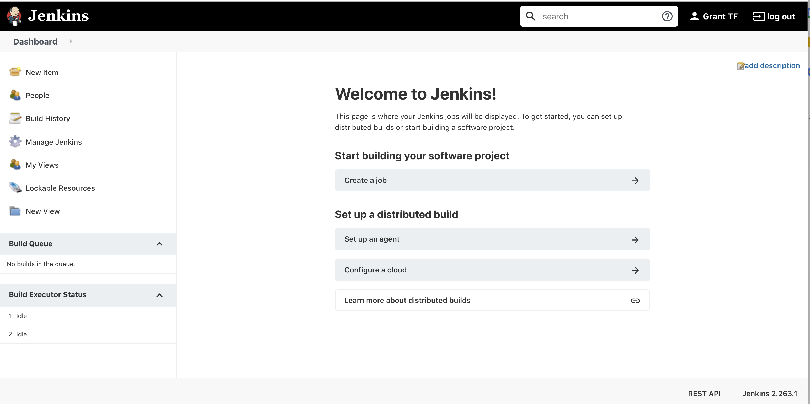
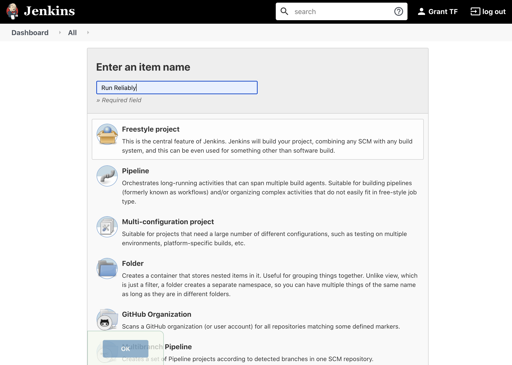
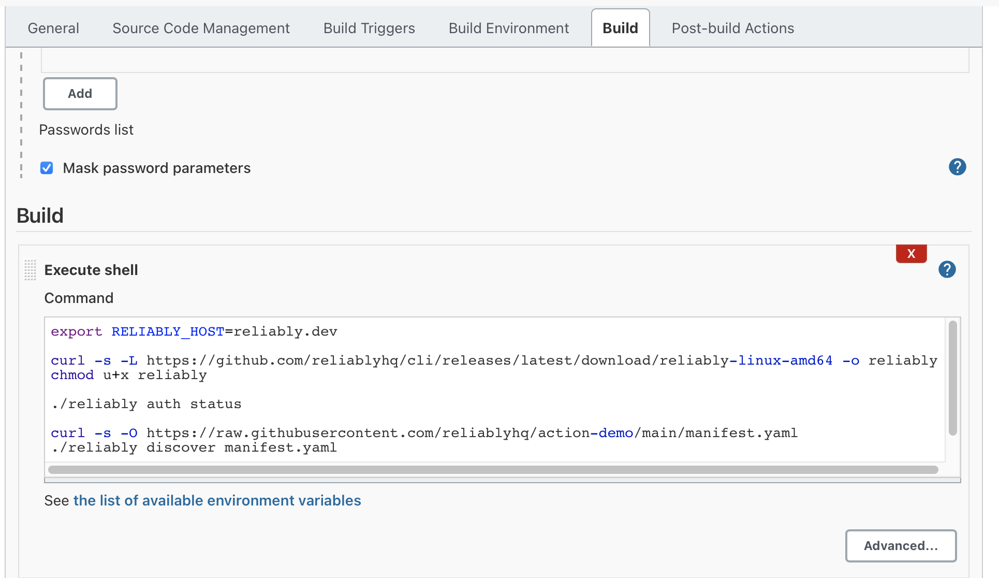
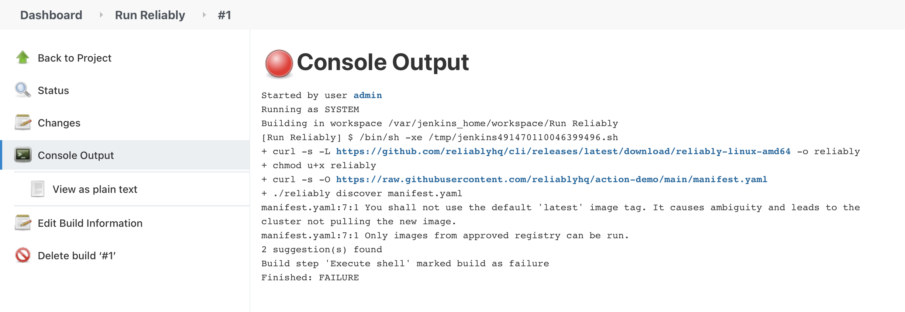

# Add Reliably to your Jenkins Build

Adding Reliably to your Jenkins build is as simple as adding a job to
[Jenkins][jenkins-home].

## Prerequisites

To run Reliably as a Jenkins Job you will need acess to a
[Jenkins][jenkins-home] server.

[jenkins-home]: https://www.jenkins.io/
[reliably-home]: https://reliably.com/

* [Jenkins installation instructions][jenkins-install]

[jenkins-install]: https://www.jenkins.io/doc/book/installing/

## Create a Reliably Build Step in Jenkins

Navigate to your Jenkins server home page:



:::note Note
  The above screenshot is for a newly installed Jenkins server. A server that
  has previously run jobs would show the jobs dashboard on the Jenkins home
  page.
:::

Selected *New Item* from the menu on the left of the page.



Enter an item name (e.g. Run Reliably). Select the *Freestyle project* option, then select OK.

In the new job display that appears next select the Build tab, then select *Execute Shell* from the *Add Build Step* dropdown menu

In the command window enter these commands:

```bash
curl -s -L https://github.com/reliablyhq/cli/releases/latest/download/reliably-linux-amd64 -o reliably
chmod u+x reliably

curl -s -O https://raw.githubusercontent.com/reliablyhq/action-demo/main/manifest.yaml
./reliably discover manifest.yaml
```

What does this do?

* The Reliably latest release is downloaded from Github.
* The binary is given execute permissions.
* A manifest file is downloaded from a Github repository.
* Finally, the `reliably discover` command is run, which will scan the manifest
  file for any issues.

The discover command will discover and surface suggestions where you might be
able to avoid reliability problems.



Select *Save*

In the menu for the project:

* Select the *Build Now* option
* Select the resulting *Job* that appears at the bottom of the menu.
* Select the *Console Output* for the *Job*, you should see output similar to:



Congratulations you have successfully run Reliably as part of a Jenkins build!