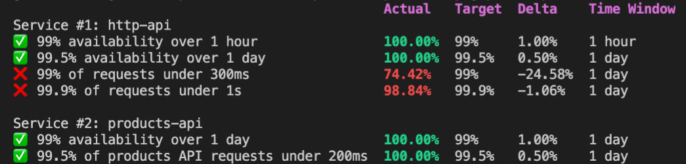

import AsciiPlayer from '~/components/AsciiPlayer.vue'

# How Reliably CLI works

## SLO Report

### About Service Level Objectives

Service Level Objectives identify what you should care about on your system.
 They are what good looks like for the users of your system. If an SLO is underperforming, it will be impacting your users in some way.

With Reliably, the manifest file is at the centre of how you manage and report against your system objectives.

The Reliably manifest will identify one or more Services. Each service will have one or more SLOs. Each SLO will have a target, this is expressed as a percentage. Associated with each SLO, you can define one or more SLIs. The SLI is used to collect metrics to determine if the SLO is meeting its objective.

To get you started with SLOs, you can use the Reliably `slo report init` command (link) to generate a reliably manifest.

<AsciiPlayer id="QogWMsBCW5Y3Zmgka5OdCKHDo" />

An example Reliably Manifest is shown here:

```yaml
services:
- name: http-api
  service-levels:
  - name: 99% availability over 1 hour
    type: availability
    slo: 99
    sli:
    - id: project-id/google-cloud-load-balancers/resource-id
      provider: gcp
    window: PT1H
  - name: 99.5% availability over 1 day
    type: availability
    slo: 99.5
    sli:
    - id: project-id/google-cloud-load-balancers/resource-id
      provider: gcp
    window: PT24H
  - name: 99% of requests under 300ms
    type: latency
    criteria:
      threshold: 300ms
    slo: 99
    sli:
    - id: project-id/google-cloud-load-balancers/resource-id
      provider: gcp
    window: PT24H
  - name: 99.9% of requests under 1s
    type: latency
    criteria:
      threshold: 1s
    slo: 99.9
    sli:
    - id: alpha1-e3d83fa0/google-cloud-load-balancers/resource-id
      provider: gcp
    window: PT24H
```

Reliably will use this manifest to generate a Reliably SLO report. Reliably currently supports GCP and AWS as platforms for services. Reliably will extend the supported platforms in future releases.

Reliably will determine the status of your SLOs by gathering metrics from the associated SLIs from the platform provider.

### Time Window

When you define your SLI, you specify an Observation window that you want to measure the service over. The choices for the observation window are:

* 1 hour
* 1 day
* 1 week
* 1 month
* custom

When you select a custom observation window, you specify a custom period using
 the ISO-8601 period format.  Example ISO-8601 formats are:

* PT1H   - a 1 hour time window
* P1D    - a 1 day time window
* P13DT3H27M -a 13 Day, 3 Hour & 27 Minute time window

The wikipedia page has more details on [ISO-8601 durations](https://en.wikipedia.org/wiki/ISO_8601#Durations)

:::note Note
The period of the observation window supports precision to 1 minute.

The period of the observation window must be less than 1 year.
:::


### Availability SLO

For availability, Reliably will calculate the percentage of error responses in
 the time window. All 5xx status responses are counted as errors.

### Latency SLO

For latency reliably will determine the percentage of responses under the
 threshold specified for the SLO.

### Reliability Report

For all the SLOs defined in the manifest, Reliably will construct a report
 showing if the target for the SLO is met or not. You can specify different
 output formats for the SLO report (see link). The default tabbed output for a
 manifest would be:



## More on that subject

[How Reliably Scans Resources](/docs/guides/how-it-works/scan-resources/)

[How the Reliably API works](/docs/guides/how-it-works/api/)

[How the Reliably Rules work](/docs/guides/how-it-works/rules/)

## Not using Reliaby yet?

[Getting started with Reliably](/docs/getting-started/)
