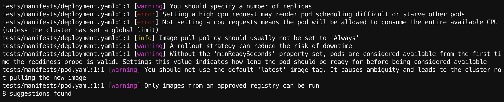
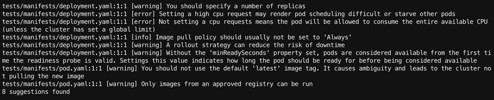
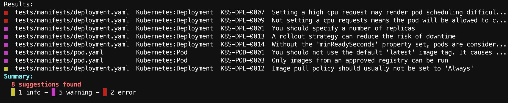
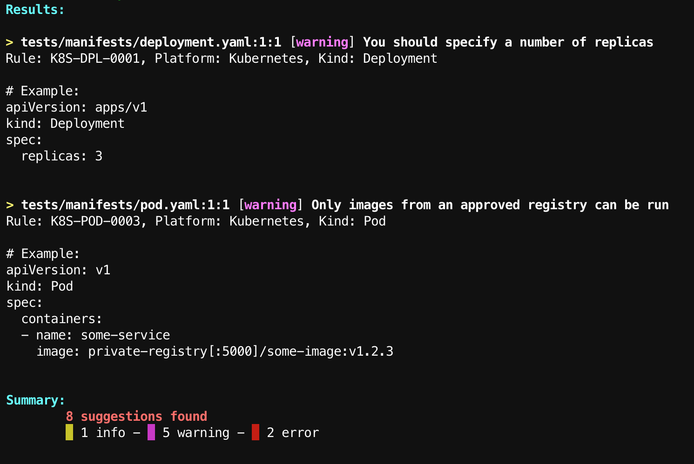

import PageIntroduction from '~/components/PageIntroduction.vue'
import Spacer from '~/components/Spacer.vue'

# Output Formats

<PageIntroduction>

The <code>reliably scan</code> command supports different output formats,
depending on your needs.

</PageIntroduction>

Apart from the standard list output, we support YAML and JSON structured
content, SARIF and CodeCLimate formats for your CI/CD workflows, an _extended_
output that displays best practice for each suggestions, and a _tabbed_ output
ideal for human eyes.

The output format selection is made with the `-f` or `--format` flags.

The `--format` or `-f` flag supports the following options, which are described in the
rest of this guide:

* `simple`
* `json`
* `yaml`
* `sarif`
* `codeclimate`
* `extended`
* `tabbed`

## Standard output with `simple`

The `-f simple` flag is the standard output. It is equivalent to not using the
format flag at all.

```bash
$ reliably scan . -f simple
```



If you want to remove the colors, you can use the global `--no-color` flag.

```bash
$ reliably scan . -f simple --no-color
```



## Tabbed output with `tabbed`

The tabbed output is the more visual one, aiming at being easy to scan and
understand. It's output is sorted in a decreasing **Error**, **Warning**,
**Info** order. Lines might be truncated to prevent wrapping.

```bash
$ reliably scan . -f tabbed
```



The tabbed output supports the `--no-color` global flag, but it pretty much
defeats its purpose!

## Best practice examples with `extended`

When running a CLI scan, the resulting suggestions can be displayed
with an optional example of a best practice to be applied. To do so, you'll
need to run the `scan` command with the specific `extended` format:

```console
$ reliably scan . -f extended
```

The CLI will output the list of suggestions with examples, as well as a
recap summary:



## Structured data with `json` and `yaml`

Should you need to pass (semi-)structured data to an other application, the CLI
can output JSON or YAML.

Following is a (truncated) JSON output example:

```bash
$ reliably scan . -f json
```

```json
{
  "suggestions": [
    {
      "rule_id": "K8S-DPL-0001",
      "rule_definition": "Missing replicas",
      "details": "You should specify a number of replicas",
      "level": "warning",
      "file": "tests/manifests/deployment.yaml",
      "line": 1,
      "column": 1,
      "platform": "Kubernetes",
      "type": "Deployment",
      "name": "myapp"
    },
    ...
  ],
  "Counters": {
    "error": 2,
    "info": 1,
    "warning": 5
  }
}
```
<Spacer />

And here is a (equally truncated) YAML output example:

```bash
$ reliably scan . -f yaml
```

```yaml
suggestions:
- ruleid: K8S-DPL-0001
  ruledef: Missing replicas
  message: You should specify a number of replicas
  level: warning
  file: tests/manifests/deployment.yaml
  line: 1
  col: 1
  platform: Kubernetes
  kind: Deployment
  name: myapp
...
counters:
  error: 2
  info: 1
  warning: 5
```

## Code Quality with SARIF and CodeClimate

The CLI can output suggestions in the SARIF and CodeClimate formats. We use
those formats to display suggestions in GitHub and GitLab, respectively. You can
use them to pass your suggestions to any other compatible application.

```bash
$ reliably scan . -f sarif
```

Here is an example of a suggestion displayed in GitHub Code Scanning alerts,
using the SARIF format.


[Read more about running Reliably in your GitHub Actions](/guides/ci-pipeline/github-action/)

<Spacer />

```bash
$ reliably scan . -f codeclimate
```

Here is an example of a suggestion displayed in GitLab Code Quality, which uses 
CodeClimate.


[Read more about running Reliably in GitLab CI](/guides/ci-pipeline/gitlab-pipeline/)