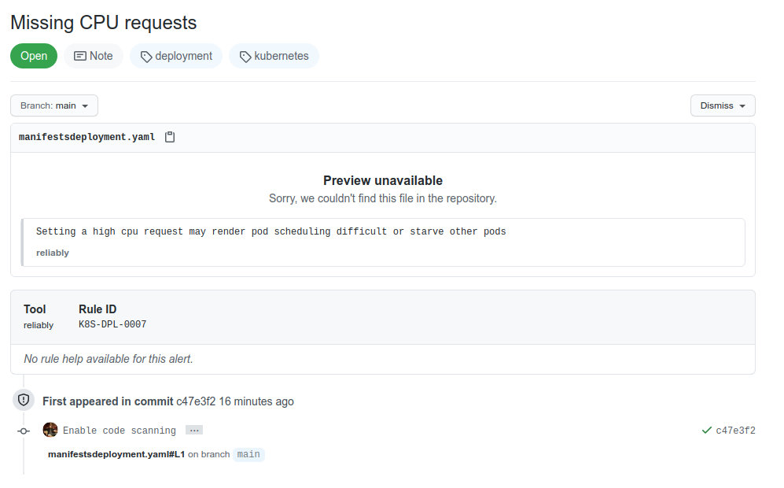
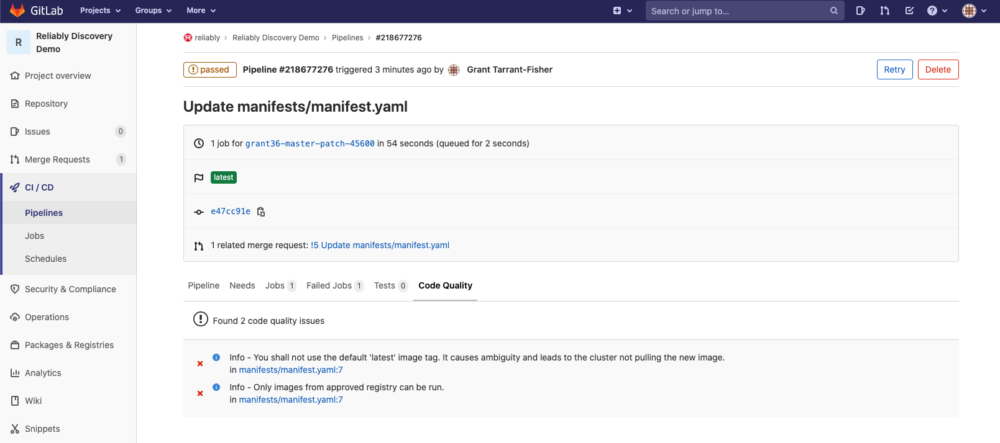

import PageIntroduction from '~/components/PageIntroduction.vue'

# Output Formats

<PageIntroduction>


The <code>reliably scan</code> command supports different output formats,
depending on your needs.

</PageIntroduction>

Apart from the standard list output, we support YAML and JSON structured
content, SARIF and CodeCLimate formats for your CI/CD workflows, an _extended_
output that displays best practice for each suggestions, and a _tabbed_ output
ideal for human eyes.

The output format selection is made with the `-f` or `--format` flags.

The `--format` or `-f` flag supports the following options, which are described in the
rest of this guide:

* `simple`
* `json`
* `yaml`
* `sarif`
* `codeclimate`
* `extended`
* `tabbed`

## Standard output with `simple`

The `-f simple` flag is the standard output. It is equivalent to not using the
format flag at all.


```reliably
<span class="token dollar"></span>reliably scan kubernetes . -f simple
Pod:chaostoolkit:0:0 [<span class="token purple">warning</span>] You shall not use the default 'latest' image tag. It causes ambiguity and leads to the cluster not pulling the new image.
Pod:nginx-deployment-5bf87f5f59-q9xsp:0:0 [<span class="token purple">warning</span>] Only images from approved registry can be run.
Deployment:hello-node:0:0 [<span class="token red">error</span>] Not setting a cpu requests means the pod will be allowed to consume the entire available CPU (unless the cluster has set a global limit)
Deployment:hello-node:0:0 [<span class="token purple">warning</span>] A rollout strategy can reduce the risk of downtime
Deployment:hello-node:0:0 [<span class="token purple">warning</span>] Without the 'minReadySeconds' property set, pods are considered available from the first time the readiness probe is valid. Settings this value indicates how long it the pod should be ready for before being considered available.
Deployment:nginx-deployment:0:0 [<span class="token red">error</span>] Setting a high cpu request may render pod scheduling difficult or starve other pods
Deployment:nginx-deployment:0:0 [<span class="token purple">warning</span>] Without the 'minReadySeconds' property set, pods are considered available from the first time the readiness probe is valid. Settings this value indicates how long it the pod should be ready for before being considered available.
7 suggestions found
```

If you want to remove the colors, you can use the global `--no-color` flag.

```reliably
<span class="token dollar"></span>reliably scan kubernetes . -f simple --no-color
Pod:chaostoolkit:0:0 [warning] You shall not use the default 'latest' image tag. It causes ambiguity and leads to the cluster not pulling the new image.
Pod:nginx-deployment-5bf87f5f59-q9xsp:0:0 [warning] Only images from approved registry can be run.
Deployment:hello-node:0:0 [error] Not setting a cpu requests means the pod will be allowed to consume the entire available CPU (unless the cluster has set a global limit)
Deployment:hello-node:0:0 [warning] A rollout strategy can reduce the risk of downtime
Deployment:hello-node:0:0 [warning] Without the 'minReadySeconds' property set, pods are considered available from the first time the readiness probe is valid. Settings this value indicates how long it the pod should be ready for before being considered available.
Deployment:nginx-deployment:0:0 [error] Setting a high cpu request may render pod scheduling difficult or starve other pods
Deployment:nginx-deployment:0:0 [warning] Without the 'minReadySeconds' property set, pods are considered available from the first time the readiness probe is valid. Settings this value indicates how long it the pod should be ready for before being considered available.
7 suggestions found
```

## Tabbed output with `tabbed`

The tabbed output is the more visual one, aiming at being easy to scan and
understand. It's output is sorted in a decreasing **Error**, **Warning**,
**Info** order. Lines might be truncated to prevent wrapping.

```reliably
<span class="token dollar"></span>reliably scan kubernetes --format tabbed
Results:
<span class="token red">■</span>  manifests/deployment.yaml  Kubernetes:Deployment         K8S-DPL-0007  Setting a high cpu request may render pod scheduling difficult or starve other pods 
<span class="token red">■</span>  manifests/deployment.yaml  Kubernetes:Deployment         K8S-DPL-0009  Not setting a cpu requests means the pod will be allowed to consume the entire available CPU (unless the cluster has set a global limit)
<span class="token purple">■</span>  manifests/deployment.yaml  Kubernetes:Deployment         K8S-DPL-0013  A rollout strategy can reduce the risk of downtime 
<span class="token purple">■</span>  manifests/deployment.yaml  Kubernetes:Deployment         K8S-DPL-0014  Without the 'minReadySeconds' property set, pods are considered available from the first time the readiness probe is valid. Settings this value indicates how long it the pod should be ready for before being considered available.
<span class="token purple">■</span>  manifests/deployment.yaml  Kubernetes:Deployment         K8S-DPL-0001  You should specify a number of replicas 
<span class="token purple">■</span>  manifests/pod.yaml         Kubernetes:Pod                K8S-POD-0001  You should not use the default 'latest' image tag. It causes ambiguity and leads to the cluster not pulling the new image
<span class="token purple">■</span>  manifests/pod.yaml         Kubernetes:Pod                K8S-POD-0003  Only images from an approved registry can be run 
<span class="token yellow">■</span>  manifests/deployment.yaml  Kubernetes:Deployment         K8S-DPL-0012  Image pull policy should usually not be set to 'Always' 
<span class="token yellow">■</span>  test-manifest.yaml:92:1    Kubernetes:PodSecurityPolicy  K8S-PSP-0001  Enabling privileged can lead to unwanted escalation from the container's process 
<span class="token yellow">■</span>  test-manifest.yaml:92:1    Kubernetes:PodSecurityPolicy  K8S-PSP-0007  To reduce risk of accessing files outside of an allowed paths, it's best to make them read only 
<span class="token blue bold">Summary:</span>
  <span class="token red bold">10 suggestions found</span>
  <span class="token yellow">■</span> 3 info - <span class="token purple">■</span> 5 warning - <span class="token red">■</span> 2 error
```

The tabbed output supports the `--no-color` global flag, but it pretty much
defeats its purpose!

## Best practice examples with `extended`

When running a CLI scan, the resulting suggestions can be displayed
with an optional example of a best practice to be applied. To do so, you'll
need to run the `scan` command with the specific `extended` format. 
The CLI will output the list of suggestions with examples, as well as a
recap summary:

```reliably
<span class="token dollar"></span>reliably scan kubernetes --format extended
<span class="token blue bold">Results:</span>

<span class="token yellow">></span> <span class="token bold">test-manifest.yaml:92:1</span> [<span class="token yellow bold">info</span>] <span class="token bold">Enabling privileged can lead to unwanted escalation from the container's process</span>
Rule: K8S-PSP-0001, Platform: Kubernetes, Kind: PodSecurityPolicy

# Example:
apiVersion: policy/v1beta1
kind: PodSecurityPolicy
spec:
  privileged: false  # Prevents creation of privileged Pods


<span class="token yellow">></span> <span class="token bold">manifests/deployment.yaml:1:1</span> [<span class="token purple bold">warning</span>] <span class="token bold">You should specify a number of replicas</span>
Rule: K8S-DPL-0001, Platform: Kubernetes, Kind: Deployment

# Example:
apiVersion: apps/v1
kind: Deployment
spec:
  replicas: 3


<span class="token yellow">></span> <span class="token bold">manifests/deployment.yaml:1:1</span> [<span class="token red bold">error</span>] <span class="token bold">Setting a high cpu request may render pod scheduling difficult or starve other pods</span>
Rule: K8S-DPL-0007, Platform: Kubernetes, Kind: Deployment

# Example:
spec:
  containers:
  - name: some-container
    resources:
      requests:
        cpu: "0.5"


<span class="token yellow">></span> <span class="token bold">manifests/deployment.yaml:1:1</span> [<span class="token purple bold">warning</span>] <span class="token bold">A rollout strategy can reduce the risk of downtime</span>
Rule: K8S-DPL-0013, Platform: Kubernetes, Kind: Deployment

# Example:
apiVersion: apps/v1
kind: Deployment
spec:
  replicas: 3
  strategy:
    type: RollingUpdate
    rollingUpdate:
      maxSurge: 2        # how many pods we can add at a time
      maxUnavailable: 0  # maxUnavailable define how many pods can be unavailable
                         # during the rolling update
    

<span class="token blue bold">Summary:</span>
  <span class="token red bold">4 suggestions found</span>
  <span class="token yellow">■</span> 1 info - <span class="token purple">■</span> 2 warning - <span class="token red">■</span> 1 error
```
## Structured data with `json` and `yaml`

Should you need to pass (semi-)structured data to an other application, the CLI
can output JSON or YAML.

Following is a (truncated) JSON output example:

```console
reliably scan kubernetes . -f json
```

```json
{
  "suggestions": [
    {
      "rule_id": "K8S-DPL-0001",
      "rule_definition": "Missing replicas",
      "details": "You should specify a number of replicas",
      "level": "warning",
      "file": "tests/manifests/deployment.yaml",
      "line": 1,
      "column": 1,
      "platform": "Kubernetes",
      "type": "Deployment",
      "name": "myapp"
    },
    ...
  ],
  "Counters": {
    "error": 2,
    "info": 1,
    "warning": 5
  }
}
```

And here is a (equally truncated) YAML output example:

```console
reliably scan kubernetes . -f yaml
```

```yaml
suggestions:
- ruleid: K8S-DPL-0001
  ruledef: Missing replicas
  message: You should specify a number of replicas
  level: warning
  file: tests/manifests/deployment.yaml
  line: 1
  col: 1
  platform: Kubernetes
  kind: Deployment
  name: myapp
...
counters:
  error: 2
  info: 1
  warning: 5
```

## Code Quality with SARIF and CodeClimate

The CLI can output suggestions in the SARIF and CodeClimate formats. We use
those formats to display suggestions in GitHub and GitLab, respectively. You can
use them to pass your suggestions to any other compatible application.

```console
reliably scan kubernetes . -f sarif
```

Here is an example of a suggestion displayed in GitHub Code Scanning alerts,
using the SARIF format.



[Read more about running Reliably in your GitHub Actions](/docs/guides/ci-pipeline/github-action/)

```console
reliably scan kubernetes . -f codeclimate
```

Here is an example of a suggestion displayed in GitLab Code Quality, which uses
CodeClimate.



[Read more about running Reliably in GitLab CI](/docs/guides/ci-pipeline/gitlab-pipeline/)