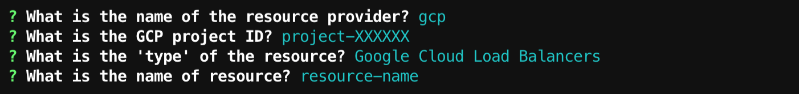

import AsciiPlayer from '~/components/AsciiPlayer.vue'

# Define Service Level Objectives

## What are SLOs again?

SLOs are one of the three Service Level concepts that power the SRE practice, 
alongside Service Level Indicators and Service Level Agreements.

### Service Level Indicator

An SLI is a measurement of your service's behaviour.

Error rate, latency, etc.
are SLIs.

### Service Level Objective

With SLIs in mind, an SLO is a target for your SLIs.

Example SLOs:
- 99% of successful requests on a service
- 98% of requests on a service fulfilled in less than 100 ms

### Service Level Agreement

An SLA is a contract with your users (whether they are another team in your
company or end users of your product) about the consequences of missing an SLO.

:::tip
If you want to read more about the SRE terminology, the Google Cloud Blog 
article <a href="https://cloud.google.com/blog/products/devops-sre/sre-fundamentals-slis-slas-and-slos" target="_blank" rel="noopener noreferer">SRE fundamentals: SLIs, SLAs and SLOs</a> is a good starting point.
:::

## Defining SLOs in Reliably

### With the CLI

Running the `reliably slo init` will prompt you with questions to help you 
define an SLO.

<AsciiPlayer id="ML46wVaFwURMW92zAIFSBWx4y" />

* You must answer **Yes** to the question "Are you building something that will be provided to customers 'as a service'?"
* Your "error budget" is expressed as a percentage. If you want a 99.99% SLO, you should answer 0.01.
* You must answer **Yes** when asked if you want to add a service resource.
* We currently support **AWS** and **Google Cloud Platform** as providers.
* Learn how to identify your AWS resources and GCP resources [here](#providers).
* Answer **Yes** when asked if you want to add another service.

The Reliably CLI will then create a `reliably.yaml` configuration file in your 
working directory. This file will be used to 
[generate your SLO report](/docs/guides/slo/slo-reports/).

You could also create this configuration file yourself, as explained in the next
section.

### With a YAML file

Your SLOs are stored in a `reliably.yaml` configuration file, in your working
directory. You could generate it with the `reliably slo init` command, as 
explained in the previous section, or create it yourself.

```yaml
slo:
  objective:
    latency: 500ms
    error_budget_percent: 1
  resources:
  - id: project-id/google-cloud-load-balancers/resource-id
    provider: gcp
  - id: arn:partition:service:region:account-id:resource-id
    provider: aws
dependencies: []

```

AWS resources are identified with their ARN.

GCP resources are identified with a project ID, the resource type (only "Google
Cloud Load Balancers" are currently supported), and the resource name.

## Providers

### AWS

Resources on AWS are identified with their Amazon Resource Name. Learn more 
about <a href="https://docs.aws.amazon.com/general/latest/gr/aws-arns-and-namespaces.html" target="_blank" rel="noopener noreferer">ARNs in the AWS documentation</a>.

If **manually creating** the `reliably.yaml` configuration file, you will want to provide this information in the following format:

```yaml
resources:
  - id: arn:partition:service:region:account-id:resource-id
    provider: aws
```

Note the `'arn:` prefix.

### Google Cloud Platform

The Reliably CLI can currently fetch Service Level Indicators for **services that are attached to a Google Cloud Load Balancer**. You will thus need a load balancer set up to define and report SLOs for GCP.

When defining a service with GCP as provider, you will be prompted with three questions.



The **project ID** can be found in the "Project info" card of your <a href="https://console.cloud.google.com/home/dashboard" target="_blank" rel="noopener noreferer">Google Cloud Console Dashboard</a>.


The **resource name** can be found in the <a href="https://console.cloud.google.com/net-services/loadbalancing/" target="_blank" rel="noopener noreferer">Network services / Load balancing section of the Google Cloud Console</a>, where all your services attached to a load balancer are listed.

If **manually creating** the `reliably.yaml` configuration file, you will want to provide this information in the following format:

```yaml
resources:
  - id: project-XXXXXX/google-cloud-load-balancers/resource-name
    provider: gcp
```

## Measure and Report

Now that your SLOs are defined, the Reliably CLI will be able to 
[query the resources for SLIs and generate SLO reports](/docs/guides/slo/slo-reports/).

## Reference

Read the [Reliably CLI SLO Init command](/docs/reference/cli/reliably-slo-init/) reference for a complete list of options.