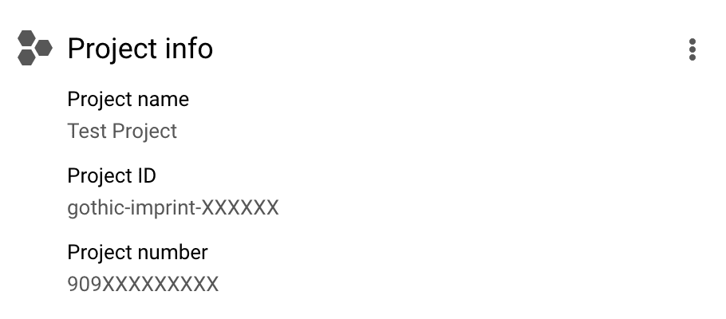

import AsciiPlayer from '~/components/AsciiPlayer.vue'

# Define Service Level Objectives

## YAML manifest

Service Levels Objectives in Reliably are defined in a `reliably.yaml` manifest file. Below is an example manifest defining two services, http-api and products-api, each with its own SLO.

```yaml
services:
- name: http-api
  service-levels:
  - name: 99% availability over 1 hour
    type: availability
    slo: 99
    sli:
    - id: arn:partition:service:region:account-id:resource-id
      provider: aws
    window: PT1H
- name: products-api
  service-levels:
  - name: 99.5% of products API requests under 200ms
    type: latency
    criteria:
      threshold: 200ms
    slo: 99.5
    sli:
    - id: project-id/google-cloud-load-balancers/resource-id
      provider: gcp
    window: PT24H
```

### Observation window

SLOs are defined by the percentage of "good" events over a time window. You can use 1 hour, 1 day, 1 week, or 1 month preset observation windows, or define a custom one.

Definition of custom observation windows follows the **ISO8601** standard. You can define a duration with one of the following two formats:

* P[n]DT[n]H[n]M
* P[n]W

[n] are numbers, with D, H, M and W respectively representing **D**ays, **H**ours, **M**inutes and **W**eeks.

Examples:

| ISO8601 format | Human readable duration         |
| -------------- | ------------------------------- |
| P4W            | 4 weeks                         |
| P2D            | 2 days                          |
| PT24H          | 24 hours                        |
| PT10M          | 10 minutes                      |
| P3DT7H36M      | 3 days, 7 jours, and 36 minutes |

### AWS resources

Resources on AWS are identified with their Amazon Resource Name. Learn more
about <a href="https://docs.aws.amazon.com/general/latest/gr/aws-arns-and-namespaces.html" target="_blank" rel="noopener noreferer">ARNs in the AWS documentation</a>.

You will want to provide this information in the following format:

```yaml
resources:
  - id: arn:partition:service:region:account-id:resource-id
    provider: aws
```

Note the `arn:` prefix.

### Google Cloud Platform resources

GCP resources are identified with a project ID, the resource type, and the resource name.

```yaml
resources:
  - id: project-XXXXXX/google-cloud-load-balancers/resource-name
    provider: gcp
```

:::note
The Reliably CLI can currently fetch Service Level Indicators for **services that are attached to a Google Cloud Load Balancer**. You will thus need a load balancer set up to define and report SLOs for GCP.
:::

You can get the project ID and resource name from the gcloud CLI or the Google Cloud Console.
#### gcloud CLI

The **project ID** can be found by running:

```console
$ gcloud config get-value project
```

If you want to use a different project than the current one configured on your
machine, list all of them with:

```console
$ gcloud projects list
```

The **resource name** can be found with:

```console
$ gcloud compute url-maps list
```

#### Google Cloud Console

The **project ID** can be found in the "Project info" card of your <a href="https://console.cloud.google.com/home/dashboard" target="_blank" rel="noopener noreferer">Google Cloud Console Dashboard</a>.



The **resource name** can be found in the <a href="https://console.cloud.google.com/net-services/loadbalancing/" target="_blank" rel="noopener noreferer">Network services / Load balancing section of the Google Cloud Console</a>, where all your services attached to a load balancer are listed.

## With the CLI

The `reliably slo init` command can guide you through the creation of this file.

Running `reliably slo init` will prompt you with questions to help you
define an SLO.

<AsciiPlayer id="QogWMsBCW5Y3Zmgka5OdCKHDo" />

### Service

```reliably
<span class="token green">?</span> <span class="token bold">What is the name of the service you want to declare SLOs for?</span> <span class="token blue">http-service</span>
```

With Reliably, SLOs are attached to a service. You will first be asked to define a name for a service before you can define its SLOs.

### SLO Type

```reliably
<span class="token green">?</span> <span class="token bold">What type of SLO do you want to declare?</span>  <span class="token blue">[Use arrows to move, type to filter]</span>
<span class="token blue bold">&gt; Availability</span>
  Latency
```

You can choose either availability or latency SLOs. **Availability SLOs** are based on the success of a particular request. **Latency SLOs** are based on the completion of a request under a **time threshold**.

### Target and latency threshold

```reliably
<span class="token green">?</span> <span class="token bold">What is your target for this SLO (in %)?</span> <span class="token blue">99.9</span>
```

You must specify a **target** for your SLO. This is what good looks like for your SLO and is expressed as a percentage. For example, for an Availability SLO, a target of 98% would mean 98% of the events were successfull.

If you select the latency SLO type, you will also be prompted to provide a **threshold** in milliseconds. All reponses within this threshold contribute to your target.

```reliably
<span class="token green">?</span> <span class="token bold">What type of SLO do you want to declare?</span> <span class="token blue">Latency</span>
<span class="token green">?</span> <span class="token bold">What is your target for this SLO (in %)?</span> <span class="token blue">99.9</span>
<span class="token green">?</span> <span class="token bold">What is your latency threshold (in milliseconds)?</span> <span class="token blue">300</span>
```

### Observation window

```reliably
<span class="token green">?</span> <span class="token bold">What is your observation window for this SLO?</span>  <span class="token blue">[Use arrows to move, type to filter]</span>
<span class="token blue bold">&gt; 1 hour</span>
  1 day
  1 week
  1 month
  custom
```

```reliably
<span class="token green">?</span> <span class="token bold">What is your observation window for this SLO?</span> <span class="token blue">custom</span>
<span class="token green">?</span> <span class="token bold">Define your custom observation window</span> <span class="token blue">[? for help]</span>
```

Read the ["Observation Window" section](#observation-window) for details about the **ISO8601** standard used to define time windows.

### Service Resource

If you want to measure your SLO and generate [SLO reports](../slo-reports/), you will need to add a service resource. Service resources are resources from your cloud provider which Reliably uses to get your service level data.

```reliably
<span class="token green">?</span> <span class="token bold">On which cloud provider?</span> <span class="token blue">[Use arrows to move, type to filter]</span>
<span class="token blue bold">&gt; Amazon Web Services</span>
  Google Cloud Platform
```

Once you've selected a cloud provider, you will be asked to paste an resource identifier, or you can type `i` to enter an interactive mode which will help you identify the service you want to get data from.

:::important
You will need to be authentified to Google Cloud or AWS for interactive mode to work.
:::

Here is what interactive mode looks like for AWS:

```reliably
<span class="token green">?</span> <span class="token bold">On which cloud provider?</span> <span class="token blue">Amazon Web Services</span>
<span class="token green">|</span> <span class="token bold">Paste an AWS ARN, or type "i" for interactive mode.</span> <span class="token blue">[? for help]</span>
<span class="token green">|</span> <span class="token bold">Select an AWS partition.</span> <span class="token blue">[Use arrows to move, type to filter]</span>
<span class="token blue bold">&gt; aws</span>
  aws-cn
  aws-us-gov
  aws-iso
  aws-iso-b
```

```reliably
<span class="token green">?</span> <span class="token bold">On which cloud provider?</span> <span class="token blue">Amazon Web Services</span>
<span class="token green">|</span> <span class="token bold">Paste an AWS ARN, or type "i" for interactive mode.</span> <span class="token blue">[? for help]</span>
<span class="token green">|</span> <span class="token bold">Select an AWS partition.</span> <span class="token blue">aws</span>
<span class="token green">|</span> <span class="token bold">Select an AWS region.</span> <span class="token blue">eu-west-3</span>
<span class="token green">|</span> <span class="token bold">Select an AWS service.</span> <span class="token blue">API Gateway</span>
<span class="token green">|</span> <span class="token bold">Select a Resource.</span> <span class="token blue">simple-http-api (3tf7ct9s4y)</span>
```

Here is what interactive mode looks like for Google Cloud:

```reliably
<span class="token green">?</span> <span class="token bold">On which cloud provider?</span> <span class="token blue">[Use arrows to move, type to filter]</span>
  Amazon Web Services
<span class="token blue bold">&gt; Google Cloud Platform</span>
```

```reliably
<span class="token green">?</span> <span class="token bold">On which cloud provider?</span> <span class="token blue">Google Cloud Platform</span>
<span class="token green">|</span> <span class="token bold">Select an Organization.</span>  <span class="token blue">[Use arrows to move, type to filter]</span>
<span class="token blue bold">&gt; organization-name</span>
```

```reliably
<span class="token green">?</span> <span class="token bold">On which cloud provider?</span> <span class="token blue">Google Cloud Platform</span>
<span class="token green">|</span> <span class="token bold">Select an Organization.</span> <span class="token blue">chaosiq.io</span>
<span class="token green">|</span> <span class="token bold">Select an Project.</span> <span class="token blue">Project One (project-one)</span>
<span class="token green">|</span> <span class="token bold">What is the 'type' of the resource?</span> <span class="token blue">Google Cloud Load Balancers</span>
<span class="token green">|</span> <span class="token bold">Select a resource.</span> <span class="token blue">staging-lb</span>
```

You will then be asked if you want to add another service for this SLO. Answering Yes will trigger the same set of questions.

```reliably
<span class="token green">?</span> <span class="token bold">Do you want to add another resource for measuring your SLI?</span> <span class="token greyed">(y/N)</span>
```

### SLO Name

Once your SLOs in defined, you will be asked to name it. The Reliably CLI will suggest you with a name based upon how you described your SLO. Press `Enter` to keep this name, or type one which suits you better.

```reliably
<span class="token green">?</span> <span class="token bold">What is the name of this SLO?</span> <span class="token greyed">(99.9% of requests faster than 300ms over last 1 day)</span>
```

### Additional SLOs and Services

You will then be asked if you want to add more SLOs to this service, then if you want to add more services to your manifest.

:::important
When you're done, the CLI will confirm your manifest has been successfully created in your working directory.

```reliably
<span class="token green">✓</span> Your manifests has been saved to ./reliably.yaml
````

The manifest file will also uploaded to the Reliably SaaS. The local `reliably.yaml`file will be used to
[generate your SLO report](/docs/guides/slo/slo-reports/).
:::

## Measure and Report

Now that your SLOs are defined, the Reliably CLI will be able to
[query the resources for SLIs and generate SLO reports](/docs/guides/slo/slo-reports/).

## Reference

Read the [Reliably CLI SLO Init command](/docs/reference/cli/reliably-slo-init/) reference for a complete list of options.