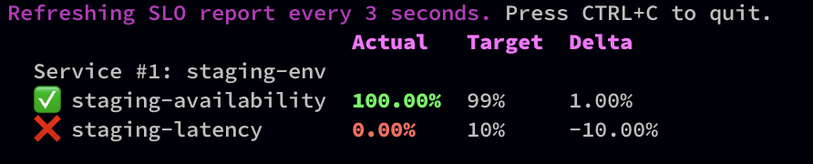

# Live Reporting

When you have [defined](./define-slos/) your Service Level Objectives (SLO's) monitoring
 them should give you a great indication to the state of you system. You can
  also use the Reliably CLI for this.

## Watch

The Reliably CLI has a watch flag that will continually fetch
new metrics and update the displayed report on your terminal every 3 seconds.

You can have this running while you make changes to your system. If your
updates impact your SLO's, this will be reflected in the displayed report in
near real-time.

To monitor your SLO's live via the terminal, add the `--watch / -w` flag.

```
$ reliably slo report --watch
```



## Reference

Read the [Reliably CLI SLO Reports command][ref-slo-report] reference for a
 complete list of options.

[ref-slo-report]:/docs/reference/cli/reliably-slo-report/