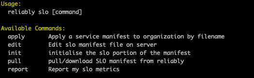

# Service Level Objectives Commands

The Reliably CLI contains a full set of commands to allow you to define and report on you Service Levels Objectives.

## Reference

Read the [Reliably CLI SLO](/docs/reference/cli/reliably-slo/) reference section for a complete list of SLO Command options.

