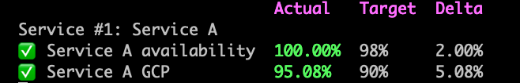
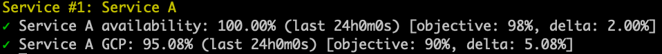

import AsciiPlayer from '~/components/AsciiPlayer.vue'

# Generate Service Level Objectives reports

Now that you have [defined your SLOs](/docs/guides/slo/define-slos/), you can use the
Reliably CLI to query your resources for SLIs and generate SLO reports.

This is done with the `reliably slo report` command.

:::note
In order for the Reliably CLI to be able to query your service provider, you
will need to be authenticated.

* [Authenticating with AWS](#aws)
* [Authenticating with GCP](#google-cloud-platform)
:::

## Usage

```
$ reliably slo report
```
<AsciiPlayer id="PYkU2mtpYifgjQfDaetX6b0sT" />

The `reliably slo report` command will look for a `reliably.yaml`. It will
then fetch data from your service providers, agregate the data if you have
several services defined as indicators for your SLO, and return error rates and
latency numbers for the last 24 hours, alongside your target and the delta for
the period.

### Specify YAML file

Reliably will look for a file named `reliably.yaml` in your  working directory.
You tell the CLI to use another file by specifying its path specified with the
`--manifest` or `-m` flag.

```
$ reliably slo report --manifest path/to/file.yaml
```

## Output format

You can select between output formats with the `--format` or `-f` flag.

### Tabbed output

Tabbed output is the default format for SLO reports.

```
$ reliably slo report --format tabbed
```


### Simple Output

The simple output will remove the tabs, and use glyphs instead of emojis for
your SLO status, and will not display SLO target and delta.

```
$ reliably slo report --format simple
```


If you want to disable the glyph coloring, you can use the `--no-color` global
flag.

```
$ reliably slo report --format simple --no-color
```

### JSON Output

You can generate a JSON-formatted SLO report for consumption in third-party
tools.

```
$ reliably slo report --format json
```

## Provider Authentication

For the CLI to be able to connect to your provider and fetch data, you will need
to be authenticated.

## Watch

An SLO report status can be monitored via the terminal using the `--watch / -w` flag. This flag
will continuously fetch and update the report every 3 seconds.

```
$ reliably slo report --watch
```


### AWS

Authentication with AWS is made through an `credentials` file in your
`$HOME/.aws` directory.

```
[default]
aws_access_key_id = <your access key>
aws_secret_access_key = <your secret access key>
```

<a href="https://aws.github.io/aws-sdk-go-v2/docs/configuring-sdk/#specifying-credentials/" target="_blank" rel="noopener noreferer">Read more in the AWS SDK docs.</a>

### Google Cloud Platform

You can authenticate be using the  `GOOGLE_APPLICATION_CREDENTIALS` environment variable. It is set to the file path of the JSON files that contains your service account key.

```bash
$ export GOOGLE_APPLICATION_CREDENTIALS="/home/user/Downloads/my-key.json"
```

<a href="https://cloud.google.com/docs/authentication/getting-started" target="_blank" rel="noopener noreferer">Read more about authentication methods</a> in the Google Cloud documentation.

:::note
To fetch the required data, your service account will need a specific permission: "Monitoring Viewer"
:::

## Reference

Read the [Reliably CLI SLO Reports command](/docs/reference/cli/reliably-slo-report/) reference for a complete list of options.